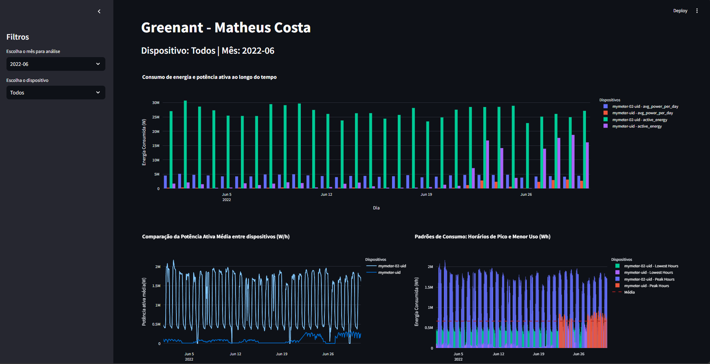

## Pré-requisitos

- Python 3.x
- Pip (gerenciador de pacotes do Python)

## Instalação

1. **Clone o repositório:**

   ```bash
   git clone https://github.com/bartcosta/dashboard.git
   cd dashboard
   ```

2. **Crie um ambiente virtual:**

   ```bash
   python3 -m venv env
   ```

3. **Ative o ambiente virtual:**

   No Unix/Linux:

   ```bash
   source env/bin/activate
   ```

   No Windows:

   ```bash
   source env/Scripts/activate
   ```

4. **Instale as dependências:**

   ```bash
   pip install -r requirements.txt
   ```

## Uso

1. **Rodando o projeto:**

   Certifique-se de que o Greenant Project esteja rodando.

   ```bash
   streamlit run main.py
   ```

## Desativação do ambiente virtual

Quando você terminar de usar o projeto, desative o ambiente virtual:

```bash
deactivate
```